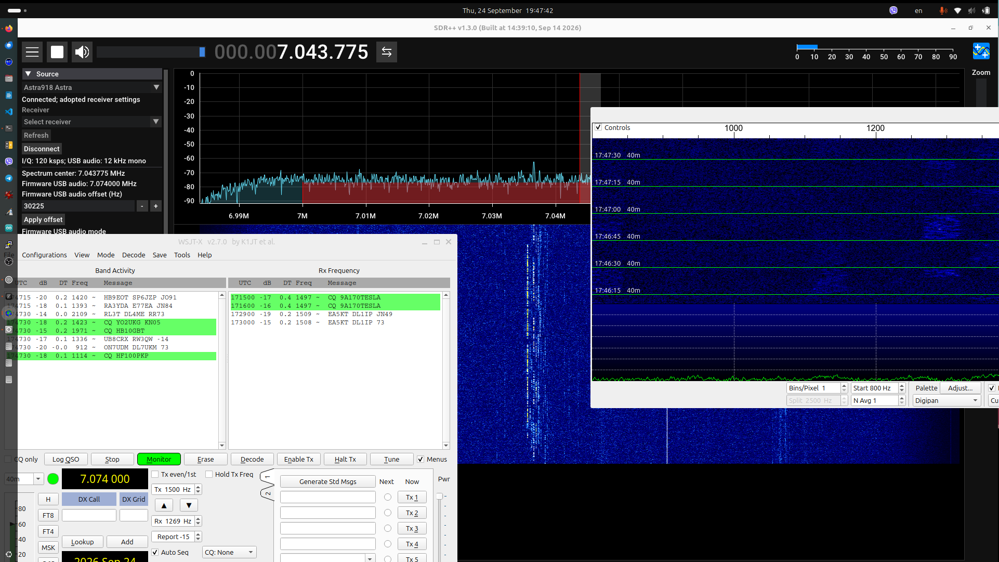

# Astra918 SDR++ source



## Install the Astra918 module into SDR++

These steps install the external source module into an existing SDR++ desktop
installation. You do not rebuild SDR++ itself. SDR++ modules use a C++ ABI, so
the module must match the SDR++ core build and architecture. The release notes
identify the upstream SDR++ commit used for each build; use the corresponding
SDR++ nightly/source build. A module is not guaranteed to load in a distro
package built from a different revision or with an incompatible compiler.

1. Install and launch the official SDR++ desktop build for your operating
   system. Close SDR++ before copying any module files.
2. Open the [latest Astra918 module release](https://github.com/ur8us/astra918sdr-sdrpp/releases/latest).
   Download the asset matching both your operating system and CPU:

   | SDR++ platform | Release asset |
   | --- | --- |
   | Linux x86-64 | `astra918_source-linux-x86_64.so` |
   | Linux ARM 64-bit (AArch64) | `astra918_source-linux-aarch64.so` |
   | Linux RISC-V 64-bit | `astra918_source-linux-riscv64.so` |
   | macOS Intel | `astra918_source-macos-x86_64.dylib` |
   | macOS Apple Silicon | `astra918_source-macos-arm64.dylib` |
   | Windows 64-bit | `astra918_source-windows-x86_64.dll` |

   Do not use a Linux file on macOS, or a file for a different CPU. The release
   also includes a text file naming the exact SDR++ source commit used by CI.
   On Windows, download `libusb-1.0.dll` from the same release as a required
   runtime dependency.
3. Put the downloaded module in SDR++'s module directory. Common locations are:
   - Linux official packages: `/usr/lib/sdrpp/plugins/` (may require
     administrator privileges). Alternatively, use a writable directory and
     add its module file to the `modules` list described in step 4. Install
     the system `libusb-1.0` runtime package if it is not already present.
   - Windows portable installation: `<SDR++ folder>\\modules\\`. If this
     folder is absent, create it beside `sdrpp.exe` and set `modulesDirectory`
     in `root_dev/config.json` to that folder. Keep any `libusb-1.0.dll`
     supplied with the release beside `sdrpp.exe`.
   - macOS app bundle: `SDR++.app/Contents/Plugins/`. If macOS blocks loading
     an unsigned third-party module, use an SDR++ build and security policy
     that permits locally built modules; do not disable system security
     globally. Install the Homebrew `libusb` runtime (`brew install libusb`)
     if the loader reports a missing libusb library.
4. If you used the configured module directory, no config edit is needed:
   SDR++ scans `modulesDirectory` at startup. If you chose another folder,
   open SDR++'s `config.json` (usually `~/.config/sdrpp/config.json` on Linux
   and macOS, or `<SDR++ folder>/root_dev/config.json` on Windows). Back it up,
   then add the full path to the module in the existing top-level `modules`
   array. For example on Linux:

   ```json
   "modules": [
     "/home/alex/sdrpp-modules/astra918_source-linux-x86_64.so"
   ]
   ```

   Preserve other entries and valid JSON commas. On Windows, use escaped
   backslashes, for example `"C:\\\\SDR++\\\\modules\\\\astra918_source.dll"`.
   Do not replace the rest of the configuration file.
5. Start SDR++ and open **Module Manager**. Find **Astra918 audio/CAT/SDR
   receiver**, enable its instance if necessary, then open **Source** and
   choose Astra918. The main **Play** button connects to the receiver and
   starts I/Q streaming. The first connection may need a moment for USB device
   discovery.
6. If the module is absent, inspect SDR++'s startup log. Check the module
   filename and configured path, CPU architecture, SDR++ core commit, and
   runtime dependencies. On Linux, `ldd <module-file>` shows missing shared
   libraries; on macOS use `otool -L <module-file>`; on Windows use a DLL
   dependency viewer. Restore the backed-up config if a JSON edit prevents
   SDR++ from starting.

### Instructions for an AI setup agent

The following may be given to a local computer-use or shell-capable AI agent:

> Set up the Astra918 external source module for the existing SDR++ installation
> on this computer. First detect the OS, CPU architecture, SDR++ executable,
> module directory, configuration file, and SDR++ build/revision. Download only
> the matching asset from
> https://github.com/ur8us/astra918sdr-sdrpp/releases/latest and check the
> release's SDR++ source commit against this installation. If compatibility
> cannot be established, stop and explain the mismatch. Close SDR++ and back up
> its configuration before changing it. Prefer the configured module directory;
> otherwise add only the absolute module path to the existing top-level
> `modules` array, preserving all other JSON values. Install any runtime
> dependency shipped with the release beside the executable where required.
> Restart SDR++, verify that Module Manager lists Astra918, and report the
> exact asset, path, compatibility check, and any load errors. Do not overwrite
> SDR++, change unrelated settings, or bypass operating-system security.

The source and protocol are developed in the [main Astra918 firmware
repository](https://github.com/ur8us/astra918sdr). Hardware and software
connections are discussed in the [EEVblog Astra918 project
thread](https://www.eevblog.com/forum/rf-microwave/astra918-cmx918rp2350-based-receiver-0-07-to-130-mhz/).

External SDR++ source for the Astra918 composite receiver. It streams 120 ksps
ci16 I/Q while WSJT-X receives the independent USB audio channel and uses CAT.
The source panel exposes signed firmware USB audio offset, firmware USB/LSB mode,
audio passband, antenna route, RF/IF gain modes and codes, LF controls,
38.4 MHz internal/external reference and eight logical GPIO values, explicit
Save, Retry and health counters. Source protocol code derives from the MIT
`cmx918_sdrpp_source` project, revision
`836b9bed51f73c83bcf63bbb268ef56252e1554e`; upstream notices are retained.

## Frequency synchronization

The firmware audio/CAT frequency is `waterfall center + firmware USB audio offset`.
All SDR++ Radio VFOs are independent local listening channels. With the
**left-right** icon, moving a VFO inside the waterfall leaves the receiver and
firmware audio tuning untouched. With the **center/aim** icon, SDR++ moves the
waterfall center, which retunes the receiver while preserving the firmware audio
offset. Any waterfall recenter, including upstream recentering at a spectrum
edge, uses this same calculation. Mouse retunes apply when released.

CAT changes move the waterfall center to `CAT dial - firmware audio offset`;
local VFO offsets stay unchanged. Editing **Firmware USB audio offset (Hz)**
moves the firmware audio channel and CAT dial while keeping the RF center fixed.
There is no linked VFO selector or separate source-panel frequency entry.
The source adopts receiver state on connect.
Its USB/LSB audio setting controls the firmware audio sent to WSJT-X. The Radio
module’s demodulation mode controls only local SDR++ listening. Stop releases
I/Q streaming and disconnects the receiver, releasing the vendor interface
without resetting audio or CAT. SDR++ Play connects the receiver and starts I/Q;
Stop disconnects it. Close/disconnect the standalone GUI before using this source.

Firmware audio offset edits use the existing atomic command 38. The receiver
must support this command; older firmware shows a firmware-update message.
The LF/MF capacitor slider is clamped to
0-4095, including keyboard entry. It applies while moving (at most ten updates
per second) and sends the final value on release; there is no Apply button.

Control commands and I/Q reads run on separate threads so receiver
reconfiguration cannot starve the USB stream. Start first stops and drains any
partial frame left by a previous owner or stalled transfer. Neither operation
resets the composite USB device. While playing, the log reports sample totals
and receiver fault counters every ten seconds.

## Portable library

Linux requires CMake 3.20+, C++17, Ninja, pkg-config, libusb development files.
macOS can use `brew install cmake ninja pkg-config libusb`. Windows uses Visual
Studio 2022 with vcpkg `libusb:x64-windows`, or a matching MinGW/libusb toolchain.

```sh
cmake -S . -B build -G Ninja -DCMAKE_BUILD_TYPE=Release
cmake --build build
ctest --test-dir build --output-on-failure
build/astra918_sim_test 127.0.0.1:7350
```

On MSVC configure with `-A x64` instead of `-G Ninja`, and
`-DCMAKE_TOOLCHAIN_FILE=<vcpkg>/scripts/buildsystems/vcpkg.cmake`; build/test
with `--config Release` / `-C Release`. Place libusb’s DLL beside executables
if the vcpkg build did not copy it automatically. Nonstandard installs can set
`LIBUSB_INCLUDE_DIR` and `LIBUSB_LIBRARY` explicitly.

## SDR++ module, all three desktop platforms

SDR++ has a C++ ABI: **headers, core library, compiler ABI and executable must
match**. Build against the SDR++ installation you will run, not unrelated
nightly headers. The local Linux validation used upstream commit
`8c9f5ee8fe405775bfcd62c8c8f8c0fc928a64af` plus the included resampler fix
(the local patched core commit is `05ffe1c8512087269333c972266bbc83d1c1f063`).

For a separate Linux upstream checkout, install its development dependencies
(FFTW3, Volk, GLFW, OpenGL, zstd, RtAudio) and run:

```sh
git clone https://github.com/AlexandreRouma/SDRPlusPlus.git ../astra-sdrpp-core
git -C ../astra-sdrpp-core checkout 8c9f5ee8fe405775bfcd62c8c8f8c0fc928a64af
python3 scripts/configure_upstream.py ../astra-sdrpp-core
cmake --build ../astra-sdrpp-core/build --parallel 4
cmake -S . -B build -G Ninja -DCMAKE_BUILD_TYPE=Release \
  -DASTRA918_BUILD_MODULE=ON \
  -DSDRPP_SOURCE_DIR=../astra-sdrpp-core \
  -DSDRPP_CORE_LIBRARY=../astra-sdrpp-core/build/core/libsdrpp_core.so
cmake --build build --parallel 4
```

`configure_upstream.py` applies the reviewed patch only to the checkout passed
to it and enables Radio and Audio Sink; additional CMake arguments follow the
path. Do not pass the read-only reference projects. The patch avoids an upstream
invalid shift when a Radio demodulator resamples upward.

On **Windows**, build upstream with its MSVC/PothosSDR dependency setup, then
use the same MSVC architecture/runtime here. `SDRPP_CORE_LIBRARY` points to the
matching `sdrpp_core.lib` import library, not the DLL. Supply dependency header
paths with `-DSDRPP_SDK_INCLUDE_DIRS="path1;path2"` and, if needed, import
libraries with `-DSDRPP_SDK_LIBRARIES="lib1;lib2"`. Copy `astra918_source.dll`
and libusb runtime DLL into the SDR++ module/runtime locations. WinUSB claims
**interface 4 only**; do not replace the audio or CDC drivers.

On **macOS**, build upstream for the same architecture using its normal CMake
dependencies (Homebrew FFTW, Volk, GLFW, zstd and RtAudio). Use the matching
`libsdrpp_core.dylib`; dependency include/link paths are found via pkg-config
or the SDK variables above. Copy `astra918_source.dylib` into the application’s
`Contents/Plugins` or an external modules directory. Keep the matching core and
dependency dylibs discoverable by the loader; sign the modified app according
to your local distribution setup. Do not mix arm64 and x86_64 binaries.

The module code includes Windows sockets and exports, POSIX sockets on Linux
and macOS, and macOS SIGPIPE protection. Local validation covers the Linux
module and Windows portable client under Wine; native Windows/macOS module
loading and USB behavior still require those hosts. CI includes a three-OS
library build and an optional matching-SDK module build. CI has not been run
remotely during this local-only implementation.

## Isolated launch and tests

For the existing local build, run this from the module repository:

```sh
./run_sdrpp.sh
```

The script also works when invoked by its path from another directory.
It loads the Astra918 module for the combined CMX918 firmware, plus Radio and
Audio Sink, using the matching sibling `../cmx918_sdrpp_upstream/build`.
Press **Refresh**, select the receiver, then **Connect** and **Play**.
The shell launcher defaults to hardware even if `ASTRA918_SIMULATOR` is set;
simulator controls are absent in release builds. For offline use, build the
module with `-DCMAKE_BUILD_TYPE=Debug` and pass
`--module build-debug/astra918_source.so --simulator HOST:PORT` explicitly.
Set `SDRPP_SOURCE` and `SDRPP_BUILD` to override the matching upstream paths. Other arguments, including
`--module` and `--help`, pass through to the Python launcher.

```sh
# Start ../astra918sdr/target/release/astra918-sim first.
python3 scripts/run.py --sdrpp-source ../astra-sdrpp-core \
  --sdrpp-build ../astra-sdrpp-core/build \
  --module build-debug/astra918_source.so --simulator 127.0.0.1:7350
# Exact module lifecycle test, with the simulator running:
build/astra918_module_test "$PWD/build/astra918_source.so" 127.0.0.1:7350
```

The launcher creates only `build/profile/`, loads Astra918, Radio and Audio Sink,
and leaves normal SDR++ preferences alone. Press Connect and Play in the source.
The lifecycle test creates real upstream VFOs and exercises normal tuning,
mouse-drag release, external CAT retunes, a secondary VFO, stream delivery,
stop/restart/reconnect. The portable client test also injects stale I/Q bytes
before Start to verify draining at reconnect.
`ASTRA918_SIMULATOR=HOST:PORT` selects the simulator only in Debug module builds.
Without it, press Refresh and select the physical receiver serial later.

Sanitizers: configure another directory with `-DASTRA918_SANITIZERS=ON` and run
CTest. See [shared protocol](../astra918sdr/docs/PROTOCOL.md) and
[validation record](../astra918sdr/docs/VALIDATION.md). No generator tests.
The [control update tests](../astra918sdr/docs/CONTROLS-2026-09-24.md) record the
earlier physical control checks. The subsequent waterfall-center tuning
correction was compiled on Linux only; its updated lifecycle checks and hardware
tests were not run, as requested.
